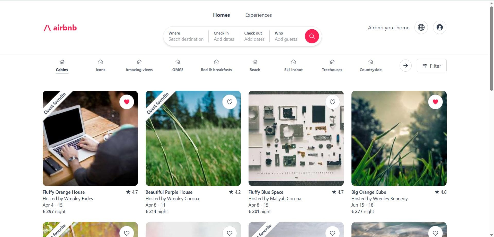

# Airbnb UX PoC

A modern and high-performance recreation of the Airbnb home page, built to showcase expertise in Frontend UX Engineering.

Key Features:
- ✅ Responsive Design – Seamlessly adapts to all screen sizes, ensuring a smooth experience across mobile, tablet, and desktop devices.
- ✅ Accessibility (a11y) – Follows WCAG guidelines, providing an inclusive experience with proper semantic HTML, ARIA attributes, and keyboard navigation.
- ✅ Performance Optimization – Efficient asset loading, lazy loading images, and minimized render-blocking resources for a fast and fluid experience.
- ✅ UX Best Practices – Intuitive navigation, clear visual hierarchy, and smooth interactions inspired by Airbnb’s real-world usability.
- ✅ Modern Technologies – Built with React, Tailwind CSS, and optimized for SEO and Core Web Vitals.

This PoC website preserves the original structure and content type. Since **it's a demo**, I prioritized performance, accessibility, architecture, and maintainability over full functionality implementation.

[Live Demo ](https://edalgrin.github.com/airbnb)